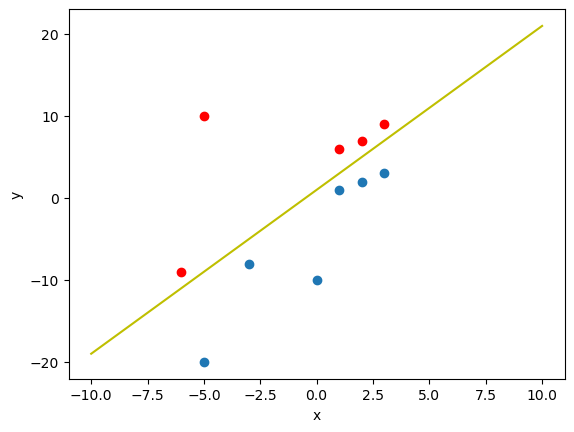
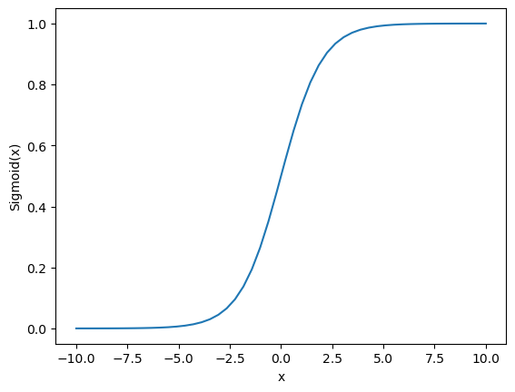
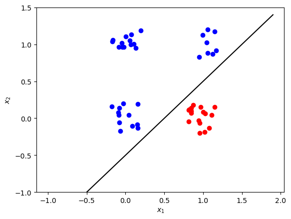

## Maths behind the single Perceptron Neural Network with Activation Function

This work is based on examples from course https://www.coursera.org/learn/machine-learning-calculus prepared by author Luis Serrano.

Linear separation refers to data points in binary classification problems that can be separated by a linear decision boundary.
If the data points can be separated by a line, linear function, or flat hyperplane, they are said to be linearly separable.

If separate points in an n-dimensional space exist, then it is said to be linearly separable

$$w_1x_1 + w_2x_2 + w_nx_n + b = 0$$

For two-dimensional input data, if there is a line, whose equation is $$w_1x_1 + w_2x_2 + b = 0$$

that separates all samples of one class from the other class, then the corresponding observation can be derived from the equation of the separating line.
Such classification problems are called "linearly separable", i.e. separating by linear combination.

The input layer contains two nodes $x_1$ and $x_2$. Weight vector $W = \begin{bmatrix} w_1 & w_2\end{bmatrix}$ and bias ($b$) are the parameters to be updated during the model training.

$$z^{(i)} = w_1x_1^{(i)} + w_2x_2^{(i)} + b = Wx^{(i)} + b.\tag{1}$$

To be able to perform classification we need nonlinear approach. This can achieved with sigmoid activation function which roughly replace values with nearly 0 or nearly 1 for most cases and some values between for small range near 0.

$$\hat{y} = \begin{cases} 1 & \mbox{if } a > 0.5 \\ 0 & \mbox{otherwise } \end{cases}\tag{10}$$

Sigmoid activation function is defined as

$$a = \sigma\left(z\right) = \frac{1}{1+e^{-z}}.\tag{2}$$

Threshold value of $0.5$ can be used for predictions: $1$ (red) if  $a > 0.5$ and $0$ (blue) otherwise.

The single perceptron neural network with sigmoid activation function can be expressed as:

\begin{align}
z^{(i)} &=  W x^{(i)} + b,\\
a^{(i)} &= \sigma\left(z^{(i)}\right).\\\tag{3}
\end{align}

With $m$ training examples organised in the columns of ($2 \times m$) matrix $X$, you can apply the activation function element-wise. So the model can be written as:

\begin {align}
Z &=  W X + b,\\
A &= \sigma\left(Z\right),\\\tag{4}
\end{align}

When dealing with classification problems, the most commonly used cost function is the **log loss**, which is described by the following equation

$$\mathcal{L}\left(W, b\right) = \frac{1}{m}\sum_{i=1}^{m} L\left(W, b\right) = \frac{1}{m}\sum_{i=1}^{m}  \large\left(\small -y^{(i)}\log\left(a^{(i)}\right) - (1-y^{(i)})\log\left(1- a^{(i)}\right)  \large  \right) \small,\tag{5}$$

where $y^{(i)} \in \{0,1\}$ are the original labels and $a^{(i)}$ are the continuous output values of the forward propagation step (elements of array $A$).

We want to minimize the cost function during the training. To implement gradient descent, calculate partial derivatives using chain rule

\begin{align}
\frac{\partial \mathcal{L} }{ \partial w_1 } &=
\frac{1}{m}\sum_{i=1}^{m} \left(a^{(i)} - y^{(i)}\right)x_1^{(i)},\\
\frac{\partial \mathcal{L} }{ \partial w_2 } &=
\frac{1}{m}\sum_{i=1}^{m} \left(a^{(i)} - y^{(i)}\right)x_2^{(i)},\tag{7}\\
\frac{\partial \mathcal{L} }{ \partial b } &=
\frac{1}{m}\sum_{i=1}^{m} \left(a^{(i)} - y^{(i)}\right).
\end{align}

Equations above can be rewritten in a matrix form

\begin{align}
\frac{\partial \mathcal{L} }{ \partial W } &=
\begin{bmatrix} \frac{\partial \mathcal{L} }{ \partial w_1 } &
\frac{\partial \mathcal{L} }{ \partial w_2 }\end{bmatrix} = \frac{1}{m}\left(A - Y\right)X^T,\\
\frac{\partial \mathcal{L} }{ \partial b } &= \frac{1}{m}\left(A - Y\right)\mathbf{1}.
\tag{8}
\end{align}

where $\left(A - Y\right)$ is an array of a shape ($1 \times m$), $X^T$ is an array of a shape ($m \times 2$) and $\mathbf{1}$ is just a ($m \times 1$) vector of ones.

Then you can update the parameters:

\begin{align}
W &= W - \alpha \frac{\partial \mathcal{L} }{ \partial W },\\
b &= b - \alpha \frac{\partial \mathcal{L} }{ \partial b },
\tag{9}\end{align}

where $\alpha$ is the learning rate. Repeat the process in a loop until the cost function stops decreasing.

in last step apply activation
$$\hat{y} = \begin{cases} 1 & \mbox{if } a > 0.5 \\ 0 & \mbox{otherwise } \end{cases}\tag{10}$$

### Dataset

As a dataset we will generate $m=50$ data points $(x_1, x_2)$, where $x_1, x_2 \in \{0,1\}$ and save them in the `NumPy` array `X` of a shape $(2 \times m)$. The labels ($0$: blue, $1$: red) will be calculated so that $y = 1$ if $x_1 = 1$ and $x_2 = 0$, in the rest of the cases $y=0$. The labels will be saved in the array `Y` of a shape $(1 \times m)$.

